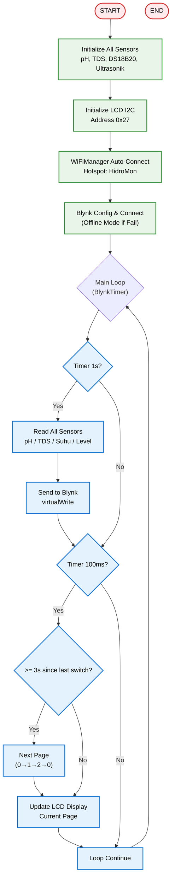
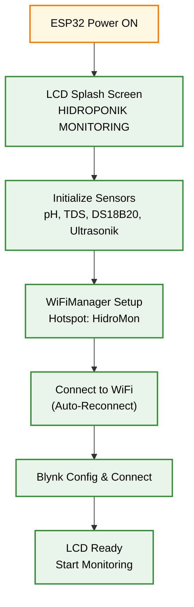

# 🌱 Sistem Monitoring Nutrisi Hidroponik Berbasis IoT

<h1 align="center">
🌿 Smart Hidroponik Monitoring System<br>
    <sub>ESP32 with Blynk, pH/TDS/Suhu/Ultrasonik Sensors & WiFiManager</sub>
</h1>

<p align="center">
  
</p>
<p align="center">
  <em>Sistem monitoring nutrisi hidroponik berbasis ESP32 dengan sensor pH, TDS, DS18B20, Ultrasonik, kontrol pompa via Blynk, dan koneksi WiFi otomatis menggunakan WiFiManager.</em>
</p>
<p align="center">
  
  
  
  
  
  
  
</p>

---

## 📋 Daftar Isi
- [Mengapa ESP32 untuk Hidroponik?](#-mengapa-esp32-untuk-hidroponik)
- [Demo Singkat](#-demo-singkat)
- [Komponen Utama](#-komponen-utama-dan-fungsinya)
- [Software & Library](#-software--library)
- [Arsitektur Sistem](#-arsitektur-sistem)
- [Alur Kerja](#-alur-kerja-sistem)
- [Instalasi](#-instalasi)
- [Cara Menjalankan](#-cara-menjalankan)
- [Aplikasi Dunia Nyata](#-aplikasi-dunia-nyata)
- [Troubleshooting](#-troubleshooting)
- [Struktur Folder](#-struktur-folder)
- [Kontribusi](#-kontribusi)
- [Pengembang](#-pengembang)
- [Lisensi](#-lisensi)

---

## 🚀 Mengapa ESP32 untuk Hidroponik?

### Keunggulan ESP32 sebagai Kontroler Hidroponik
| Fitur | Mikrokontroler Lain | ESP32 | Keuntungan |
|-------|-------------------|-------|-----------|
| **Harga** | $10-20 | $3-5 | 💰 Sangat terjangkau |
| **Performa** | 80-168 MHz | 240 MHz Dual-Core | ⚡ Cepat untuk loop monitoring |
| **Wi-Fi Built-in** | Perlu modul eksternal | Native 2.4GHz | 📡 Monitoring jarak jauh via Blynk |
| **ADC Resolution** | 10-bit | 12-bit | 📊 Pembacaan pH & TDS lebih akurat |
| **GPIO Pins** | 15-30 | 22 GPIO | 🔌 Fleksibel untuk sensor & relay |
| **Komunitas** | Sedang | Sangat besar | 🤝 Library lengkap untuk Blynk & sensor |

### Keunggulan Sistem Hidroponik IoT
✅ **Monitor Real-Time** - Pantau pH, TDS, suhu, dan level air secara langsung  
✅ **Kontrol Jarak Jauh** - Kendalikan pompa sirkulasi & dosing nutrisi via Blynk  
✅ **WiFi Auto-Connect** - Setup mudah via WiFiManager  
✅ **Display LCD** - Tampilan 3 halaman berganti otomatis  
✅ **Kalibrasi Akurat** - pH 3 titik & TDS DFRobot dengan kompensasi suhu  
✅ **Non-Blocking Loop** - Timing presisi via BlynkTimer  
✅ **Open Source** - Kode modular, mudah dimodifikasi  

---

## 📸 Demo Singkat — Sistem Monitoring Hidroponik

<p align="center">
  <em>Sistem menampilkan data pH, TDS, suhu air, level air, status pompa, dan mode koneksi. LCD berganti halaman otomatis setiap 3 detik.</em>
</p>

### <p align="center">🔄 Slide LCD (Rotasi Tiap 3 Detik)</p>

<p align="center">
  <strong>Halaman 1:</strong> pH & TDS + Suhu Air<br/>
  <strong>Halaman 2:</strong> Level Air & Status Pompa Sirkulasi<br/>
  <strong>Halaman 3:</strong> Status Nutrisi A & B + Mode Koneksi
</p>

### <p align="center">📱 Tampilan Aplikasi Blynk</p>

<p align="center">
  &nbsp;&nbsp;
  <br/>
  <em>Monitoring & kontrol dari aplikasi Blynk</em>
</p>

---

## 🧩 Komponen Utama dan Fungsinya

| Komponen | Fungsi | Keterangan |
|----------|--------|-----------|
| **ESP32 DevKit** | Otak utama sistem | Menangani loop, WiFi, Blynk, baca sensor, kontrol relay |
| **Sensor pH (PH-4502C)** | Mengukur pH larutan | ADC pin 34, kalibrasi 3 titik (4.0, 6.86, 9.18) |
| **Sensor TDS** | Mengukur nutrisi terlarut | ADC pin 35, formula DFRobot dengan kompensasi suhu |
| **DS18B20** | Mengukur suhu air | OneWire pin 4, waterproof |
| **Ultrasonik HC-SR04** | Mengukur level air | TRIG pin 5, ECHO pin 18, height 70cm |
| **LCD I2C 16x2** | Tampilan lokal | Alamat 0x27, 3 halaman berganti otomatis |
| **Relay 3 Channel** | Kontrol pompa | Sirkulasi (pin 19), Nutrisi A (pin 25), Nutrisi B (pin 26) |
| **Power Supply** | Sumber daya | 5V untuk ESP32 & sensor |

### 🔌 Wiring Diagram

```
┌──────────────────────────────────────────────────────────────────────────┐
│                           ESP32 DEVKIT V1                                │
│                                                                          │
│  ┌───────────────────────────────────────────────────────────────────┐   │
│  │                         PIN CONNECTIONS                           │   │
│  ├───────────────────────────────────────────────────────────────────┤   │
│  │  GPIO 34 (ADC1_CH6)  ←─── Sensor pH (A0)                          │   │
│  │  GPIO 35 (ADC1_CH7)  ←─── Sensor TDS (A0)                         │   │
│  │  GPIO 4              ←─── DS18B20 (DATA)                          │   │
│  │  GPIO 5              ───► Ultrasonik TRIG                         │   │
│  │  GPIO 18             ←─── Ultrasonik ECHO                         │   │
│  │  GPIO 19             ───► Relay Sirkulasi (IN1)                   │   │
│  │  GPIO 25             ───► Relay Nutrisi A (IN2)                   │   │
│  │  GPIO 26             ───► Relay Nutrisi B (IN3)                   │   │
│  │  GPIO 21 (SDA)       ←─── LCD I2C (SDA)                           │   │
│  │  GPIO 22 (SCL)       ←─── LCD I2C (SCL)                           │   │
│  │  3.3V                ───► VCC Sensor & LCD                        │   │
│  │  GND                 ───► GND Semua Komponen                      │   │
│  └───────────────────────────────────────────────────────────────────┘   │
│                                                                          │
│  ┌───────────────────────────────────────────────────────────────────┐   │
│  │                         RELAY MODULE                              │   │
│  ├───────────────────────────────────────────────────────────────────┤   │
│  │  IN1  ←─── GPIO 19   ───► COM1 ───► Pompa Sirkulasi               │   │
│  │  IN2  ←─── GPIO 25   ───► COM2 ───► Dosing Nutrisi A              │   │
│  │  IN3  ←─── GPIO 26   ───► COM3 ───► Dosing Nutrisi B              │   │
│  │  VCC  ───► 5V                                                     │   │
│  │  GND  ───► GND                                                    │   │
│  └───────────────────────────────────────────────────────────────────┘   │
└──────────────────────────────────────────────────────────────────────────┘

┌──────────────────────────────────────────────────────────────────────────┐
│                         LCD I2C 16x2 (0x27)                              │
│  ┌───────────────────────────────────────────────────────────────────┐   │
│  │  VCC ───► 5V                                                      │   │
│  │  GND ───► GND                                                     │   │
│  │  SDA ───► GPIO 21                                                 │   │
│  │  SCL ───► GPIO 22                                                 │   │
│  └───────────────────────────────────────────────────────────────────┘   │
└──────────────────────────────────────────────────────────────────────────┘

┌──────────────────────────────────────────────────────────────────────────┐
│                         SENSOR ULTRASONIK HC-SR04                        │
│  ┌───────────────────────────────────────────────────────────────────┐   │
│  │  VCC ───► 5V                                                      │   │
│  │  GND ───► GND                                                     │   │
│  │  TRIG ───► GPIO 5                                                 │   │
│  │  ECHO ───► GPIO 18                                                │   │
│  └───────────────────────────────────────────────────────────────────┘   │
└──────────────────────────────────────────────────────────────────────────┘

┌───────────────────────────────────────────────────────────────────────────┐
│                         SENSOR SUHU DS18B20                               │
│  ┌────────────────────────────────────────────────────────────────────┐   │
│  │  VCC ───► 3.3V                                                     │   │
│  │  GND ───► GND                                                      │   │
│  │  DATA ───► GPIO 4 + Resistor 4.7kΩ pull-up to VCC                  │   │
│  └────────────────────────────────────────────────────────────────────┘   │
└───────────────────────────────────────────────────────────────────────────┘
```

---

## 💻 Software & Library

### Pada ESP32 (Firmware Arduino)
| Library | Fungsi |
|---------|--------|
| **WiFi.h** | Koneksi jaringan WiFi |
| **WiFiManager.h** | Auto-setup WiFi via captive portal |
| **BlynkSimpleEsp32.h** | Koneksi ke platform Blynk IoT |
| **LiquidCrystal_I2C.h** | Driver tampilan LCD 16x2 |
| **OneWire.h** | Komunikasi OneWire untuk DS18B20 |
| **DallasTemperature.h** | Pembacaan sensor suhu DS18B20 |
| **BlynkTimer.h** | Non-blocking timer untuk loop |

### Loop Non-Blocking Overview
- **Main Loop**: Timing via BlynkTimer untuk baca sensor (1s) & update LCD (100ms)
- **pH Reading**: Moving average + EMA filter, 3-point calibration
- **TDS Reading**: DFRobot formula dengan temperature compensation
- **Ultrasonic**: PulseIn dengan timeout untuk stabilitas
- **LCD Update**: 3 halaman berganti setiap 3 detik

---

## 🏗️ Arsitektur Sistem

### Diagram Blok Sistem
```
              ┌───────────────────────┐
              │   Blynk Cloud         │
              │   (IoT Platform)      │
              └──────────┬────────────┘
                         │ MQTT/TCP
                         ▼
            ┌──────────────────────────────┐
            │ ESP32 Core (Arduino Loop)    │
            │──────────────────────────────│
            │ - BlynkTimer (1s)            │
            │ - Sensor Reading             │
            │ - LCD Update (100ms)         │
            │ - Relay Control              │
            └──────────┬───────────────────┘
                       │
           ┌───────────┴───────────┐
           │                       │
           ▼                       ▼
┌─────────────────────┐ ┌─────────────────────┐
│ SENSORS             │ │ ACTUATORS           │
│─────────────────────│ │─────────────────────│
│ pH (GPIO 34)        │ │ Relay Sirkulasi     │
│ TDS (GPIO 35)       │ │ (GPIO 19)           │
│ DS18B20 (GPIO 4)    │ │ Relay Nutrisi A     │
│ Ultrasonik          │ │ (GPIO 25)           │
│ (GPIO 5 & 18)       │ │ Relay Nutrisi B     │
└─────────────────────┘ │ (GPIO 26)           │
                        └─────────────────────┘
                       │
                       ▼
           ┌────────────────────────────┐
           │ LCD Display 16x2 (I2C)     │
           │────────────────────────────│
           │ 3 Pages: pH/TDS, Level,    │
           │ Nutrisi Status             │
           └────────────────────────────┘
```

### Diagram Alur Data
```
┌───────────────────────────────────────┐
│ WiFiManager (Setup)                   │
│ - Captive portal for SSID/Password    │
└────────────────────┬──────────────────┘
                     │ WiFi Connect
                     ▼
┌───────────────────────────────────────┐
│ Blynk Connection                      │
│ - config(auth) + connect()            │
│ - Jika gagal: Offline Mode            │
└────────────────────┬──────────────────┘
                     │
                     ▼
┌───────────────────────────────────────┐
│ Main Loop (BlynkTimer)                │
│ ┌───────────────────────────────────┐ │
│ │ Baca Sensor (1s)                  │ │
│ │ - pH (3-point calibration)        │ │
│ │ - TDS (DFRobot formula)           │ │
│ │ - Suhu (DS18B20)                  │ │
│ │ - Level Air (Ultrasonik)          │ │
│ └───────────────────────────────────┘ │
│ ▼                                     │
│ ┌───────────────────────────────────┐ │
│ │ Kirim ke Blynk (1s)               │ │
│ │ - virtualWrite semua sensor       │ │
│ └───────────────────────────────────┘ │
│ ▼                                     │
│ ┌───────────────────────────────────┐ │
│ │ Update LCD (100ms)                │ │
│ │ - 3 halaman berganti tiap 3s      │ │
└─────────────────────────────────────┘ │
└───────────────────────────────────────┘
```

### Flowchart Sistem


---

## 🔄 Alur Kerja Sistem

### 1. Inisialisasi Sistem


### 2. Pembacaan Sensor (Timer 1s)
```
Timer 1s Callback:
  1. Baca Suhu (DS18B20)
  2. Baca pH (3-point calibration + EMA filter)
  3. Baca TDS (DFRobot formula + temp compensation)
  4. Baca Level Air (Ultrasonik)
  5. Kirim ke Blynk (virtualWrite)
```

### 3. Kalibrasi pH (3 Titik)
```
Kalibrasi berdasarkan data real:
  pH 4.00 → V = 1.405V
  pH 6.86 → V = 0.933V
  pH 9.18 → V = 0.552V

Interpolasi Linear:
  if (voltage >= V7) {
    pH = 4.0 + (6.86 - 4.0) * (1.405 - voltage) / (1.405 - 0.933)
  } else {
    pH = 6.86 + (9.18 - 6.86) * (0.933 - voltage) / (0.933 - 0.552)
  }

EMA Filter: pH = 0.85 * pH_old + 0.15 * pH_raw
```

### 4. Kalibrasi TDS (DFRobot Formula)
```
TDS = (133.42 * V³ - 255.86 * V² + 857.39 * V) * 0.5
dimana V = voltage / (1.0 + 0.02 * (temp - 25.0))
```

### 5. LCD Display Management
```
Setiap 3 detik:
  Halaman 0: pH + TDS & Suhu
  Halaman 1: Level Air & Status Pompa
  Halaman 2: Status Nutrisi A & B + Mode
```

---

## ⚙️ Instalasi

### 1. Clone Repository
```bash
git clone https://github.com/ficrammanifur/nutrisi-hidroponik-blynk.git
cd nutrisi-hidroponik-blynk
```

### 2. Setup Arduino IDE

#### Install ESP32 Board Package
1. Buka Arduino IDE
2. File → Preferences
3. Tambahkan URL di "Additional Boards Manager URLs":
   ```
   https://raw.githubusercontent.com/espressif/arduino-esp32/gh-pages/package_esp32_index.json
   ```
4. Tools → Board Manager → Cari "ESP32" → Install

#### Install Required Libraries
Buka Arduino IDE → Sketch → Include Library → Manage Libraries, cari dan install:
- **Blynk** by Blynk (versi terbaru)
- **LiquidCrystal I2C** by Frank de Brabander
- **OneWire** by Paul Stoffregen
- **DallasTemperature** by Miles Burton
- **WiFiManager** by tzapu

### 3. Konfigurasi Blynk
1. Buat akun di [Blynk Cloud](https://blynk.cloud)
2. Buat template baru:
   - Name: Monitoring Hidroponik
   - Hardware: ESP32
3. Dapatkan Template ID & Auth Token
4. Update di firmware:
```cpp
#define BLYNK_TEMPLATE_ID "TMPL6ENxF696M"
#define BLYNK_TEMPLATE_NAME "Monitoring Hidroponik"
#define BLYNK_AUTH_TOKEN "9m6jA4bhAQCT-vRrYLtxhq-QMYnVCTBh"
```

### 4. Upload ke ESP32
```
1. Hubungkan ESP32 ke PC via USB
2. Tools → Board → ESP32 Dev Module
3. Tools → Port → Pilih port ESP32
4. Sketch → Upload
5. Monitor Serial (Baud: 115200)
```

### 5. Setup WiFi (Pertama Kali)
```
1. ESP32 akan membuat hotspot "HidroMon"
2. Connect ke hotspot (password: hidro123)
3. Buka browser ke 192.168.4.1
4. Pilih WiFi Anda dan masukkan password
5. ESP32 akan restart dan terhubung
```

---

## 🚀 Cara Menjalankan

### 1. Persiapan Awal
```bash
# Pastikan ESP32 terhubung via USB
# Pastikan semua sensor terpasang dengan benar
# Pastikan WiFi router aktif
# Pastikan Blynk auth token benar
```

### 2. Power On & Auto-Connect
```
1. Upload firmware
2. Reset ESP32
3. ESP32 akan auto-connect ke WiFi (jika sudah disimpan)
4. Jika pertama kali, akan buat hotspot "HidroMon"
5. Blynk akan terhubung otomatis
6. LCD menampilkan data sensor
```

### 3. Monitor Output
```
- LCD menampilkan 3 halaman berganti setiap 3 detik
- Buka aplikasi Blynk untuk monitoring jarak jauh
- Serial Monitor (115200 baud) untuk debug
```

### 4. Kontrol via Blynk
```
- Tombol Sirkulasi: Kontrol pompa sirkulasi
- Tombol Nutrisi A: Dosing nutrisi A (Active LOW)
- Tombol Nutrisi B: Dosing nutrisi B (Active LOW)
```

### 5. Kalibrasi Sensor

#### Kalibrasi pH
```
1. Siapkan larutan buffer pH 4.0, 6.86, 9.18
2. Celupkan sensor ke buffer pH 4.0
3. Catat voltage (baca di Serial Monitor)
4. Ulangi untuk pH 6.86 dan 9.18
5. Update nilai V4, V7, V9 di kode
```

#### Kalibrasi Ultrasonik
```
1. Ukur tinggi tandon (TANK_HEIGHT)
2. Update #define TANK_HEIGHT 70.0
```

---

## 🌍 Aplikasi Dunia Nyata

### 🌱 1️⃣ Hidroponik Skala Rumah Tangga
**Masalah:** Pengguna sulit memantau nutrisi hidroponik secara manual.  
**🤖 Solusi:** Sistem monitoring otomatis dengan alert jika pH/TDS tidak ideal.  
**Teknologi:** Blynk notifikasi jika parameter di luar range.

### 🏢 2️⃣ Smart Farming / Urban Farming
**Masalah:** Petani hidroponik butuh monitoring real-time dari jarak jauh.  
**🤖 Solusi:** Dashboard Blynk untuk monitor banyak tanaman sekaligus.  
**Teknologi:** Multiple ESP32 untuk setiap rak tanaman.

### 🎓 3️⃣ Edukasi IoT & Pertanian
**Masalah:** Siswa butuh proyek IoT yang aplikatif.  
**🤖 Solusi:** Platform pembelajaran sensor, aktuator, dan IoT.  
**Nilai Tambah:** Belajar kalibrasi sensor, Blynk, WiFiManager.

### 🏭 4️⃣ Hidroponik Skala Komersial
**Masalah:** Petani komersial butuh monitoring 24/7 dengan dosing otomatis.  
**🤖 Solusi:** Sistem dosing otomatis berdasarkan pembacaan sensor.  
**Teknologi:** Tambah algoritma kontrol PID untuk pH & EC.

---

## 📊 Hasil Pengujian

| Parameter | Nilai | Status |
|-----------|-------|--------|
| **pH Accuracy** | ±0.1 pH | ✅ Akurat |
| **TDS Accuracy** | ±5% | ✅ Akurat |
| **Suhu Accuracy** | ±0.5°C | ✅ Akurat |
| **Level Accuracy** | ±0.5cm | ✅ Akurat |
| **Loop Timing** | 1s (BlynkTimer) | ✅ Non-Blocking |
| **LCD Refresh** | 100ms | ✅ Smooth |
| **WiFi Reconnect** | Auto | ✅ Stabil |
| **Blynk Response** | <1s | ✅ Cepat |
| **Memory Usage** | <100 KB | ✅ Efisien |

---

## 🐞 Troubleshooting

### pH Sensor Tidak Stabil
**Gejala:** Nilai pH melonjak atau tidak masuk akal.  
**Solusi:**
```
1. Periksa koneksi sensor pH
2. Pastikan BNC connector kering
3. Kalibrasi ulang dengan buffer fresh
4. Ganti probe pH jika sudah tua
```

### TDS Sensor Tidak Terbaca
**Gejala:** TDS selalu 0 atau nilai terlalu tinggi.  
**Solusi:**
```
1. Periksa koneksi TDS sensor
2. Bersihkan probe TDS
3. Pastikan suhu terbaca (untuk kompensasi)
4. Cek ADC range (0-4095)
```

### WiFi Gagal Connect
**Gejala:** ESP32 terus membuat hotspot.  
**Solusi:**
```
1. Reset WiFiManager: Hapus data di SPIFFS
2. Cek SSID/password di captive portal
3. Router: Coba 2.4GHz only
4. Jarak: Dekatkan dengan router
```

### Blynk Tidak Connect
**Gejala:** Mode OFFLINE di LCD.  
**Solusi:**
```
1. Cek BLYNK_AUTH_TOKEN di kode
2. Cek Template ID di Blynk Cloud
3. Pastikan WiFi terhubung
4. Cek internet connection
```

### Relay Tidak Berfungsi
**Gejala:** Pompa tidak menyala saat tombol Blynk ON.  
**Solusi:**
```
1. Periksa logika relay (Nut A & B = Active LOW)
2. Cek wiring relay
3. Cek power supply 5V
4. Test manual dengan digitalWrite
```

### LCD Tidak Menampilkan Teks
**Gejala:** Layar kosong atau kotak-kotak.  
**Solusi:**
```
1. Cek alamat I2C (0x27 atau 0x3F)
2. Putar potensiometer kontras
3. Periksa koneksi SDA/SCL
4. Cek power LCD (5V)
```

---

## 📁 Struktur Folder

```
nutrisi-hidroponik-blynk/
├── 📄 README.md                    # Dokumentasi proyek
├── 📄 LICENSE                      # MIT License
├── 🤖 firmware/
│   └── esp32/
│       └── main.ino                # Kode utama ESP32
├── 🔬 kalibrasi/
│   ├── HC-SR04/
│   │   └── get-distance.ino        # Test jarak ultrasonik
│   └── PH-4502C/
│       └── get-voltage.ino         # Test voltage pH
├── 📁 assets/                      # Gambar & diagram
│   ├── hidroponik_banner.png
│   ├── blynk-app.png
│   ├── blynk-app-control.png
│   └── schematic.png
└── 📁 test/                        # Modul pengujian
    ├── ph_test.ino                 # Test pH sensor
    ├── tds_test.ino                # Test TDS sensor
    ├── ultrasonic_test.ino         # Test ultrasonik
    └── relay_test.ino              # Test relay
```

---

## 📦 WiFiManager Configuration

Proyek ini menggunakan [WiFiManager](https://github.com/tzapu/WiFiManager) untuk manajemen koneksi WiFi yang mudah.

### 📋 Cara Kerja WiFiManager

```cpp
#include <WiFiManager.h>

WiFiManager wifiManager;
bool wifiConnected = false;

void initWiFi() {
    wifiManager.setConfigPortalTimeout(120);
    wifiManager.setDebugOutput(false);
    
    bool connected = wifiManager.autoConnect("HidroMon", "hidro123");
    if (connected) {
        wifiConnected = true;
        Serial.printf("Connected to: %s\n", WiFi.SSID().c_str());
        Serial.printf("IP: %s\n", WiFi.localIP().toString().c_str());
    } else {
        wifiConnected = false;
        Serial.println("Offline mode");
    }
}
```

### 🔧 Pengaturan WiFiManager

| Parameter | Nilai | Keterangan |
|-----------|-------|------------|
| **AP Name** | `HidroMon` | Nama hotspot yang muncul |
| **AP Password** | `hidro123` | Password untuk koneksi |
| **Timeout** | `120 detik` | Waktu tunggu setup |
| **Debug** | `false` | Nonaktifkan log |

### 📱 Langkah Setup WiFi

1. **ESP32 akan membuat hotspot** `HidroMon`
2. **Hubungkan perangkat** ke hotspot (password: `hidro123`)
3. **Buka browser** ke `192.168.4.1`
4. **Pilih WiFi** dari daftar
5. **Masukkan password** WiFi
6. **Save** → ESP32 restart & connect

### 🧹 Reset WiFiManager

Untuk menghapus konfigurasi WiFi yang tersimpan:

```cpp
// Tambahkan di setup()
void setup() {
    WiFiManager wifiManager;
    wifiManager.resetSettings(); // Hapus semua konfigurasi
    // ... kode lainnya
}
```

Atau via Serial Monitor dengan perintah:
```
1. Upload kode dengan resetSettings()
2. ESP32 akan restart dan membuat hotspot baru
3. Setup ulang WiFi
```

---

## 🤝 Kontribusi
Kontribusi sangat diterima! Mari kembangkan sistem monitoring hidroponik ini bersama.

### Cara Berkontribusi
1. **Fork** repository ini
2. **Create** feature branch (`git checkout -b feature/NewFeature`)
3. **Commit** changes (`git commit -m 'Add NewFeature'`)
4. **Push** to branch (`git push origin feature/NewFeature`)
5. **Open** Pull Request

### Area Pengembangan
- [ ] Tambah sensor EC (Electrical Conductivity)
- [ ] Auto-dosing nutrisi berdasarkan pH & TDS
- [ ] Deep sleep mode untuk hemat daya
- [ ] Database penyimpanan data historis
- [ ] Dashboard web untuk monitoring
- [ ] Notifikasi Telegram/WhatsApp
- [ ] Multi-rak monitoring
- [ ] PID control untuk pH
- [ ] Kalibrasi otomatis sensor
- [ ] OTA (Over The Air) update

---

## 👨‍💻 Pengembang
**Ficram Manifur**
- 🐙 GitHub: [@ficrammanifur](https://github.com/ficrammanifur)
- 🌐 Portfolio: [ficrammanifur.github.io](https://ficrammanifur.github.io/ficram-portfolio)
- 📧 Email: ficramm@gmail.com

### 🙏 Acknowledgments
- **Blynk Team** - Platform IoT yang luar biasa
- **tzapu** - WiFiManager library
- **DFRobot** - Formula kalibrasi TDS
- **Arduino Community** - Library & dukungan

---

## 📄 Lisensi
Proyek ini dilisensikan di bawah **MIT License** - lihat file [LICENSE](LICENSE) untuk detail lengkap.

```text
MIT License

Copyright (c) 2025 ficrammanifur

Permission is hereby granted, free of charge, to any person obtaining a copy
of this software and associated documentation files (the "Software"), to deal
in the Software without restriction, including without limitation the rights
to use, copy, modify, merge, publish, distribute, sublicense, and/or sell
copies of the Software, and to permit persons to whom the Software is
furnished to do so, subject to the following conditions:

The above copyright notice and this permission notice shall be included in all
copies or substantial portions of the Software.

THE SOFTWARE IS PROVIDED "AS IS", WITHOUT WARRANTY OF ANY KIND, EXPRESS OR
IMPLIED, INCLUDING BUT NOT LIMITED TO THE WARRANTIES OF MERCHANTABILITY,
FITNESS FOR A PARTICULAR PURPOSE AND NONINFRINGEMENT. IN NO EVENT SHALL THE
AUTHORS OR COPYRIGHT HOLDERS BE LIABLE FOR ANY CLAIM, DAMAGES OR OTHER
LIABILITY, WHETHER IN AN ACTION OF CONTRACT, TORT OR OTHERWISE, ARISING FROM,
OUT OF OR IN CONNECTION WITH THE SOFTWARE OR THE USE OR OTHER DEALINGS IN THE
SOFTWARE.
```

---

<div align="center">
  
**🌿 Smart Hidroponik Monitoring with IoT & Blynk**

**⚡ Built with ESP32, Blynk, and Open Source**

**⭐ Star this repo if you like it!**

<p><a href="#top">⬆ Back on Top</a></p>
</div>
